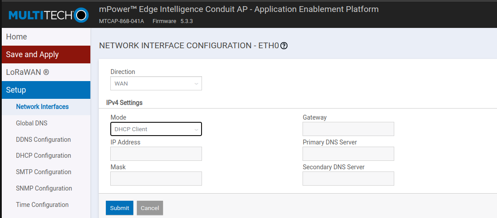
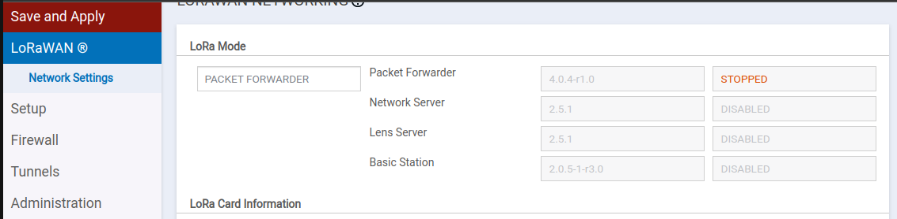
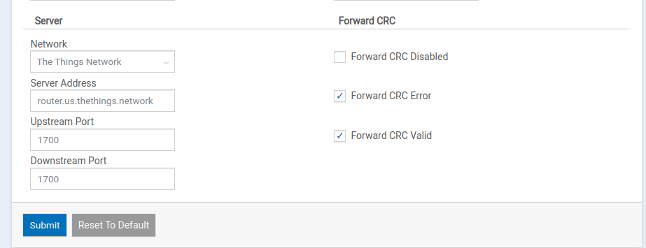

<link rel="stylesheet" href="style.css">

#### CAUBEL Aksel
#### PRUVOST Arnaud
#### DOMERGUE Mathys
## Groupe IOT-51

# 
TP-02

## 
Configuration de la gateway LoraWan

 
 
 

 

 

## Pour mettre en place la gateway :

<a href='https://www.multitech.com/documents/publications/training/S000812--Configuring-mDot-w-MTACP-using-LoRa-App-Note.pdf'>Source Documentation</a>

 
<li> Prendre une IP sur le réseau 192.168.2.x/24, car l'IP par défaut de la Gateway est 192.168.2.1</li>

 

<li> Après avoir créé un utilisateur, dans notre cas l'utilisateur 'root' avec le mot de passe 'IOT51AMA.', suivre la configuration de base qui consiste à configurer les paramètre de base de la gateway tel que l'heure. </li>

 

<li> Une fois la configuration de base finie, aller dans "setup" -> "Network Interfaces" puis modifier "eth0" pour le passer en mode WAN, puis ensuite changer l'IPv4 Settings en mode DHCP Client. Une fois la configuration validée il la gateway redémarre, il faut donc utiliser un scanner d'IP pour pouvoir s'y reconnecter avec la nouvelle IP.</li>

 

<li> Il faut maintenant configurer avec quel réseau Lora la Gateway va communiquer, dans notre cas The Things Network, aller dans "LoRaWAN" puis "Network Settings". Dans l'onglet "LoRa Mode" mettre le mode "PACKET FORWARDER" puis en bas de la page dans l'onglet "Server" mettre le serveur voulu, dans notre cas The Things Network, puis mettre la bonne adresse de serveur, dans notre cas "eu1.cloud.thethings.network". Nous avons également modifié le Duty Cycle, on l'a passé en Enable puis nous avons mis une période de 10 et un ratio de 80.
 Le duty cycle correspond à la durée de temps sur laquelle un dispositif peut émettre, il est calculé sur une heure et est exprimer en pourcentage.</li>

 

<li> Il faut ensuite enregistrer la gateway sur <a href='https://www.thethingsnetwork.org/docs/gateways/registration/'>The Things Network</a>. Pour ce faire, il faut créer un compte sur TTN ensuite, il faut cliquer sur l'icône de son compte, aller dans console choisir le bon serveur (Europe pour nous) puis remplir les informations de la Gateway (son EUI), les informations se complète automatiquement, il suffit de compléter la "frequency plan" avec le "SF9 for RX2". Ce dernier correspond au nombre de symbole utilisé pour la communication LoRa. SF9 correspondant à 9 symboles et étant le Spreading Factor conseillé. Le Spreading Factor définit également la sensibilité du signal pour la réception et le temps plus ou moins grand de communication avec un SF plus grand.</li>

 

<li>Pour le monitoring de la Gateway, le problème est que pour activer les tunnels, il faut activer des ports où nous n'avons pas le droit de les activer, car ce sont des ports pour le VPN.

Pour le monitoring à distance, il faut paramétrer la GateWays en mode CUPS, sa configuration à distance devra alors s'opérer avec le port 8887.

Une autre solution aurait pu être faite avec une autorisation de Destination Nat pour pointé sur le port SSH de la gateWay. Attention aux failles de sécurité par la suite si celà est mal géré sur la gateWay.

<a href="https://www.thethingsindustries.com/docs/gateways/concepts/lora-basics-station/cups/">Pour voir comment faire la configuration CUPS avec TTN</a></li>

 

<li> Pour le pare-feu, nous avons essayé de le faire, nous n'y sommes pas arrivés, mais nous avons compris le principe.

Le firewall peut être configuré de sorte à accepter uniquement les requêtes venant d'un certain port à un port prédéfini sur la GateWay voir même une plage de port. Avec un protocole donné.

L'exemple que nous pouvons avoir tout de suite est celui de l'ICMP. Nous ne souhaitons pas que la gateway réponde au ping ne venant pas de l'ordinateur de test que le CEFE nous a mis à disposition. De ce fait, je vais bloquer tout ce qui ne vient pas de l'adresse de cet ordinateur. (les adresses ip étant donné en fonction de la MAC).</li>