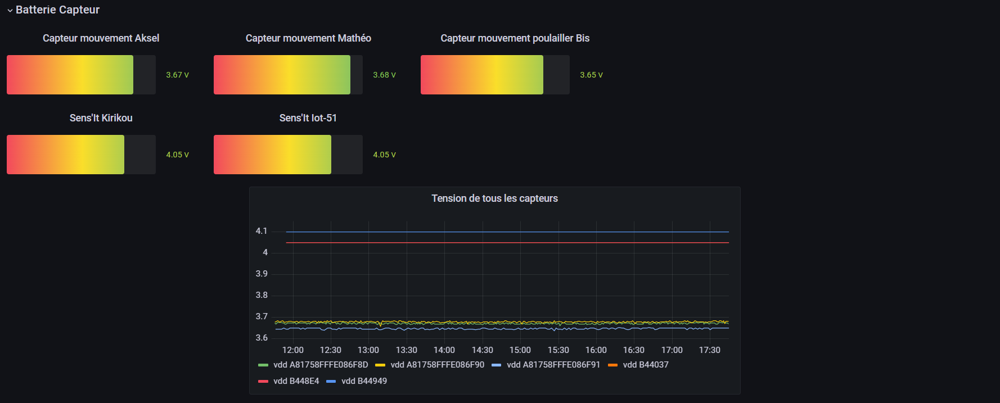

<link rel="stylesheet" href="style.css">

#### CAUBEL Aksel

#### PRUVOST Arnaud

#### DOMERGUE Mathys

## Groupe IOT-51

 

<h1 class='headerTemplate'>
Compte Rendu Partie Commanditaire
</h1>

 
 

# Poulailler Connecter : Mission Poulette

\pagebreak

<h2 class="underline"> Objectif de la mission : </h2>

<pre>

    - Monitoring de la température et l'humidité à l'intérieur du poulailler (bien-être animal).

    - Déterminer la présence des poules dans le poulailler. Il faudra notamment s'assurer de la présence des poules dans le poulailler lorsque celui-ci est fermé durant la nuit.

    - Déterminer la présence d'animaux aux alentours du poulailler durant la nuit. On suppose qu'un animal présent la nuit dans l'enclos est forcément un renard. En cas de présence avérée, le client pourra déclencher à distance un dispositif lumineux et sonore destiné à faire fuir le renard.

    - Accès aux données pour le personnel concerné

</pre>

<h2 class="underline"> Contrainte de la mission : </h2>

<pre>

    - 2 jours pour préparer l'infrastructure avant la pose.
    
    - Trouver des solutions de prototypage à partir de capteurs imposés.
    
    - Contrainte réseaux (accès aux ports).

</pre>

\pagebreak

\pagebreak

<h1> Sommaire : </h2>

<h4>

<li>CAPTEUR MISE EN PLACE AU CEFE</li>
<li>PLACEMENT DES CAPTEURS</li>
<li>PLACEMENT DES CAPTEURS résumé</li>
<li>INTERFACE HOMME/MACHINE</li>
<li>PREUVES DE CONCEPT</li>
<li>CONCLUSION</li>
<li>REMERCIMENT</li>

</h4>

\pagebreak

# Capteur mise en place au CEFE

Pour répondre au mieux au cahier est charge, une première évaluation a été faite afin de savoir quels sont les capteurs que nous aurions besoin. Mais aillant un stock prédéfini à l'IUT de Béziers nous avons dû nous rabattre sur des capteurs du même type, mais pas les plus optimum. Cela est donc une version bêta du poulailler connecté.

Après réflexion avec l'ensemble du groupe, plusieurs idées ont émergé : 
  

<li>Nous avons utilisé comme capteur de mouvement les ERS2 : </li>

<pre> Capteur infra-rouge afin de détecter uniquement des êtres vivants (ou objet chaud en mouvement).
    Avec une détection jusqu'à 5 mètres.
    Il permet également d'avoir une vision sur la luminosité de l'environnement.

    Attention : étant un capteur d'intérieur, il doit être dans une boite étanche. Il perdra donc sa capacité de faire des relever d'humidité fiable et celles pour la température donneront un ordre d'idée, mais pas une vérité absolut !
</pre>

<li>Un actionneur LoRa Dry-Contact (non implanté sur site) : </li>
<pre>
Afin d'activer à distance le système de son et lumière pour effrayer les potentiels prédateurs autour du poulailler.

Possibilité future pour actionner la porte du poulailler à distance.
</pre>

<li>Des capteurs Sigfox Sens'It 3 :</li>
<pre>Pour la fonction de capteur de Température & Humidité intérieur/extérieur.

Une possibilité future pour vérifier si la porte est ouverte ou fermée avec sa fonction magnéto-mètre. </pre>

<li>Un NFC Reader de chez RF-Track : </li>

<pre>Permettant la lecture de badge mit aux pattes des poules.</pre>

\pagebreak

# Placement des capteurs

Le placement des capteurs est crucial pour avoir des relever fiables.

 En tenant compte de la contrainte des poules qui fréquemment font tomber les différents capteurs mit en intérieur, deux capteurs (Type : Sens'it 3) on était positionné. C'est dernier peuvent relever la température ainsi que l'humidité intérieure du poulailler. Le premier se trouvant sous le bouton vert pour être en intérieur et être inaccessible aux poules (bouchon situé sur le toit). Le deuxième sur la paroi côté porte du poulailler. (voir photo ci-dessous)

 Afin de faire la pose de ce capteur, nous avons dû faire deux troues à la perceuse et y passer un Collier de serrage (rilsan). 

 

Le dernier capteur de ce type est positionné en extérieur sur le dessus du bouchon vert utilisé précédemment.

 

Les capteurs de mouvement : 

Les capteurs de mouvement ont étaient positionnés au Sud. Aillant eu que 2 capteurs, ils ont étaient positionnées de façons à être abrité de la pluie (Rappel : nous utilisons des capteurs d'intérieur -> non-résistant à la pluie et à humidité.).

Étant un prototypage, les deux capteurs surveillent la même zone dans une optique de redondance (Si un capteur ne marche plus, le deuxième continue de surveiller la zone). Voir placement ci-dessous :

 

Le dernier capteur implanté :

Le NFC Reader. Comme décris, précédemment, permet la lecture des badges que portent vos poules. Savoir où elles se trouvent peut-être très intéressant pour vous, pour essayer d'y trouver une "routine" par exemple. Si une routine est observable et qu'un jour la routine est rompu cela peut potentiellement être une sonnette d'alarme pour quelque chose.

\pagebreak

Afin d'être sûr que le capteur sera traversé ce dernier sera implanté à l'entrer du poulailler. Aillant la même problématique que les capteurs de mouvement, ce dernier est dans une boite hermétique. Nous avons entendu votre demande par rapport au fait que les poules grattent et peuvent abîmer les capteurs. Pour éviter qu'elles puissent ouvrir notre boite et détériorer le capteur, nous avons donc mit du gaffeur toute autour de cette dernière. Voir ci-dessous :  

\pagebreak

<h4 class = "underline"> Placement des capteurs, en résumé : </h4>

 Afin de mieux vous représentez où se situe nos capteurs, nous vous les avons représenté sur une photo que vous nous avez fait parvenir. Sur cette dernière seule les deux capteurs (Type : Sens'It3) mit sur le bouchon ne sont pas représentés pour cause de visibilité.

\pagebreak

# Interface Homme/Machine

Les capteurs, c'est bien, mais comprendre ce qu'ils nous disent, c'est mieux.

Notre équipe a réfléchi à tout. Besoin d'une donnée en particulier ? 

Vous avez le choix !

<li>Température Extérieur</li>
<li>Humidité Extérieur</li>
<li>Température Intérieur</li>
<li>Humidité Intérieur</li>
<li>Luminosité Extérieur</li>
<li>Mouvement détecté</li>
<li>Niveau des batteries</li>

Nous vous les avons concentrées sur notre site <a href="http://iot-51.eot-consulting.world:3000/login">iot-51.eot-consulting.world</a> avec votre compte d'accès (Nom d'utilisateur : lise.roy et votre mot de passe sécurisé : " P&9vh$68VcN> ")

Ce dernier vous permet de voir quatre grands panneaux : 

 

<h4>Information extérieure :</h4>

 
 
 

<h4>Information Intérieur :</h4>

 

<h4>Niveau des batteries :</h4>

\pagebreak

<h4>Poulailler de Viole-en-Lavard :</h4>

Intuitif, au premier regard, vous verrez l'atmosphère de votre poulailler grâce à la dernière donnée présente à droite des différents graphiques.

Les couleurs changent aussi !

Pour la température, vous observerez une couleur Bleu pour les températures en dessous de 15°c | Vert entre 15°c et 21°c | Rouge au-dessus de 21°c.

Pareil pour l'humidité qui va passer par plusieurs stades de couleurs en fonction de son pourcentage : 

<h4>Vous trouvez ça beau et pratique ? On vous rassure ce n'est pas fini !</h4>

Comme demandé un système d'alerte mail à était mis en place par notre service pour vous avertir lorsque la température du poulailler descend ou monte au-dessus des valeurs du bien-être animal ! 

Une fois, les constantes revenus à la normale (Entre 15°c et 21°c), un nouveau mail sera envoyé pour vous en informer !

\pagebreak

# Pour aller plus loin : Les preuves de concept

 

Comme dit précédemment, les équipements à disposition n'étais pas forcément les plus adéquats. C'est pour cela qu'une partie de notre travail et de vous montrez la possibilité future.

 
 

Actuellement, les poules portent des badges RFID pour être détecté par notre capteur, mais le problème que nous observons est que le capteur n'est pas fait pour cette utilisation et nécessiterait un temps d'arrêt de la poule sur le capteur. De notre côté, on peut faire fonctionner ce capteur et en sortir de la donnée. Sans rentrer dans la technique, ce moyen nous permet de savoir si la poule est entrée ou sortie en sachant juste le nombre de fois quelle a fait le chemin. Dans nos recommandations de capteur, se trouve un autre type de capteur permettant de faire ce que nous souhaitons.
Un portique utilisé a l'initiale dans les industries pour vérifier quelle caisse entre sur un convoyeur.  

 

Remplacez maintenant la boite par une poule avec une bague et plus de problèmes de contact avec le capteur ! 

 
<h4 class="underline">D'une pierre deux coups</h4>
 

Dans les capteurs à disposition, nous avons un "actionneur", malheureusement ce dernier ne fût pas prêt pour l'installation.

Un actionneur donne des possibilités infinies ; une distributeur de graine automatique, une porte automatique, un système d'alerte automatique...

Le système d'alerte, une de vos attentes que l'on a su faire avec nos contraintes, mais le concept est présent. Nous arrivons à communiquer à distance. Cela indique qu'on est capable d'avoir ce système dans votre poulailler. Ce système avec le même capteur peut actionner la porte du poulailler à distance.

 
<h4 class="underline">Alerte sécurité !</h4>
 

Les problèmes de tension qui permit au renard de rentrer dans le poulailler auraient pu être évités. Non pas par un débroussaillage régulier, mais par prévention d'un affaiblissement de tension.
Les capteurs sont de tout genre et peuvent tous faire. Ce dernier est également couplable à un système d'alerte mail lorsque la tension est en dessous d'un seuil déterminé.

\pagebreak

# Pour conclure

Le poulailler du CEFE est actuellement connecté, nous avons accès à une plage de donnée riche en diversité. Mais ce dernier n'est qu'une version "bêta" d'un poulailler connecté.

Il prouve la possible réalisation d'un poulailler 100 % connecté. Ainsi que le nombre illimité de possibilité d'ajout de capteur. Les évolutions sont donc multiples.

 

# Remerciment

Merci au CEFE d'avoir permis ce projet avec un remerciement particulier à Madame Lise Roy pour son accueil au centre CEFE.

Merci aux encadrants pédagogiques Monsieur Philippe Pujas et Monsieur Laurent Roy. 

En espérant avoir répondu à vos attentes,

<h4>Le Groupe IOT-51</h4>
