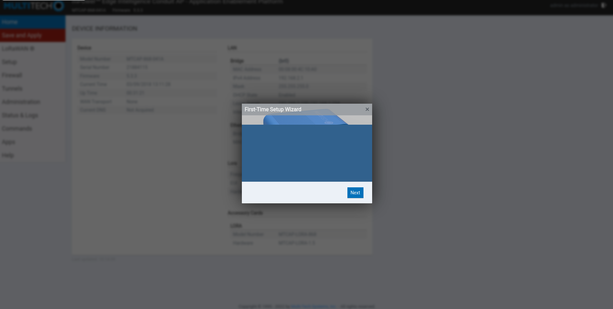
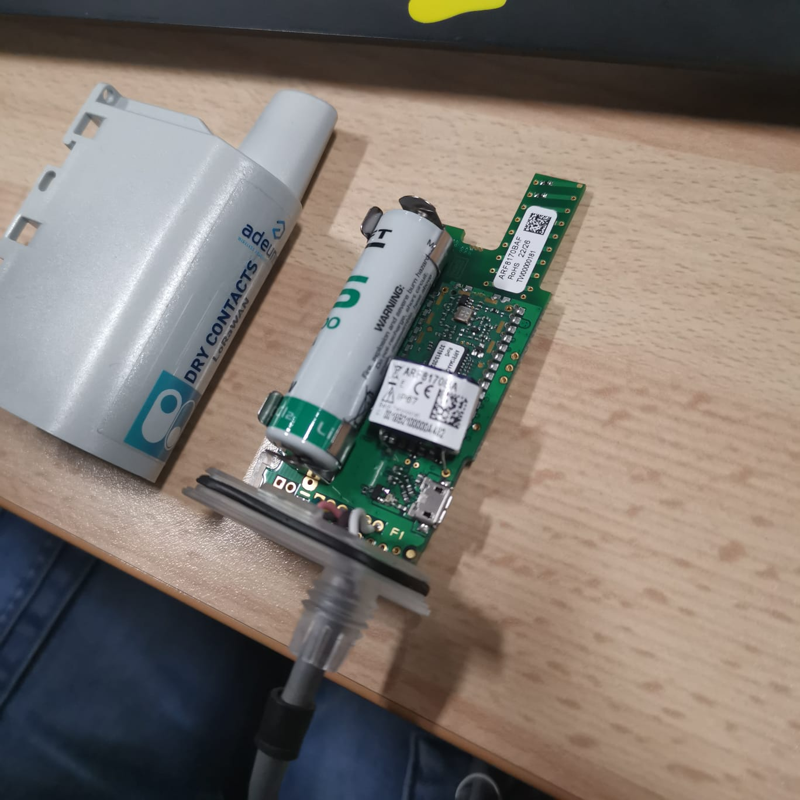
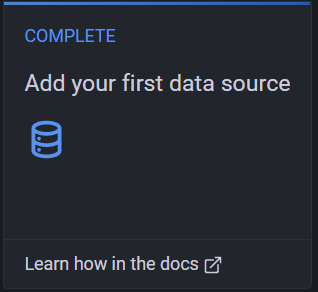

<link rel="stylesheet" href="style.css">

#### CAUBEL Aksel

#### PRUVOST Arnaud

#### DOMERGUE Mathys

## Groupe IOT-51


</br>

<h1 class='headerTemplate'><center>Compte Rendu Partie technique</center></h1>

</br>
</br>

# Poulailler Connecter : Mission Poulette

<div style="background-color:white">
<center>


</center>
</div>

<div style="page-break-after: always; visibility: hidden">
\pagebreak
</div>

# Sommaire :
## <li> Gateway </li>
## <li> Configuration des capteurs </li>
- ### Généralité
- ### Sens'it 3 Sigfox
- ### Elsys ERS2
- ### RF-Track NFC reader
- ### Adeunis Dry contact
## <li> Installation et configuration d'InfluxDB </li>
## <li> Installation et configuration de Grafana </li>
## <li> Système d'Alerte </li>
## <li> Récupération donnée Sigfox </li>
## <li> Récupération donnée TTN </li>
## <li> Annexe </li>

<div style="page-break-after: always; visibility: hidden">
\pagebreak
</div>

# Configuration de la Gateway Lora et des différents capteurs

</br>

<a href='https://www.multitech.com/documents/publications/training/S000812--Configuring-mDot-w-MTACP-using-LoRa-App-Note.pdf'>Source Documentation</a>

Pour configurer la Gateway Lora :
<br>
<li> Prendre une IP sur le réseau 192.168.2.x/24, car l'IP par défaut de la Gateway est 192.168.2.1</li>

<br>

<li> Prendre une IP sur le réseau 192.168.2.x/24, car l'IP par défaut de la Gateway est 192.168.2.1'</li>



<br>

<li> Une fois la configuration de base finie, aller dans "setup" -> "Network Interfaces" puis modifier "eth0" pour le passer en mode WAN, puis ensuite changer le IPv4 Settings en mode DHCP Client. Une fois la configuration validée il la gateway redémarre, il faut donc utiliser un scanner d'IP pour pouvoir s'y reconnecter avec la nouvelle IP.</li>


<br>

<li> Il faut maintenant configurer avec quel réseau Lora la Gateway va communiquer, dans notre cas The Things Network, aller dans "LoRaWAN" puis "Network Settings". Dans l'onglet "LoRa Mode" mettre le mode "PACKET FORWARDER" puis en bas de la page dans l'onglet "Server" mettre le serveur voulu, dans notre cas The Things Network, puis mettre la bonne adresse de serveur, dans notre cas "eu1.cloud.thethings.network". Nous avons également modifié le Duty Cycle, on l'a passé en Enable puis nous avons mis une période de 10 et un ratio de 80. <br><br>Le duty cycle correspond à la durée de temps sur laquelle un dispositif peut émettre, il est calculé sur une heure et est exprimer en pourcentage.</li>


<br>


<li> Il faut ensuite enregistrer la gateway sur <a href='https://www.thethingsnetwork.org/docs/gateways/registration/'>The Things Network</a>. Pour ce faire, il faut créer un compte sur TTN ensuite, il faut cliquer sur l'icône de son compte, aller dans console choisir le bon serveur (Europe pour nous) puis remplir les informations de la Gateway (Son EUI), les informations se complète automatiquement, il suffit de compléter le "frequency plan" avec le "SF9 for RX2". Ce dernier correspond au nombre de symbole utilisé pour la communication LoRa. SF9 correspondant à 9 symboles et étant le Spreading Factor conseillé. Le Spreading Factor définit également la sensibilité du signal pour la réception et le temps plus ou moins grand de communication avec un SF plus grand.</li>

<br>

# Pour les capteurs sur le réseau LoRa

Dans le cas des capteurs se connectant à un réseau LoRa (TTN dans notre cas) il faut au préalable les enregistrer sur le réseau en question, pour ce faire, il remplir les informations du capteur ou actionneur à savoir :

- Son devEUI (ID unique de chaque device)

- Son appEUI : même chose que le JoinEUI, ils permettent de se connecter au réseau.
- Son appKey : clé de cryptage de la communication entre le capteur et l'Application Server.

<br>

# Capteur Sens'it de Sigfox

Le capteur Sigfox étant déjà activé, on peut passer au choix de mode du capteur. Pour cela, il faut réaliser un appui long sur le bouton central, la couleur du bouton centrale varie en fonction du mode, les différents modes sont :

- Température et humidité (couleur verte)
- Capteur de luminosité (couleur jaune)
- Détecteur d'ouverture de porte (couleur bleu clair)
- Capteur de vibration (couleur bleu foncé)
- Capteur magnétique (couleur rose)

Il existe aussi un mode standby dans lequel le capteur est en veille. ( Pour économiser la batterie en cas de non-utilisation ainsi que pour ne pas envoyer de trame inutilement sur le réseau ! ) 

Ce capteur n'étant pas connecté au réseau LoRa, nous n'avons pas à l'enregistrer sur TTN, donc pour récupérer les informations transmises par le capteur, il a fallu développer un script python (voir annexe).

Vous remarquerez également que les relevés peuvent être améliorés. Actuellement, nous récupérons la dernière valeur que le capteur a remontée et cette dernière information est directement mise dans la base de données. Problème : si notre capteur n'émet plus nous verrons sa dernière donnée enregistré perpétuellement. 

Chaque problème a sa solution ; la solution est de faire pour chaque capteur Sigfox une mémorisation du timestamp de la trame pour faire une comparaison et envoyer l'information de la base de données uniquement si elle est nouvelle. (Par manque de temps, cette solution n'est pas présente, mais la résolution est donc réfléchie.).

<br>

# Capteur Elsys ERS2 (Mouvement, température, humidité et luminosité)

<li> Pour pouvoir mettre en place le capteur ERS2 il faut premièrement insérer 2 piles, cela va mettre en route le capteur.<br>Lorsque cela est fait, il faut utiliser l'application "Sensor settings" d'Elsys qui va nous permettre de configurer le capteur. <br>
Dans l'application, il faut aller dans "Advanced mode" puis sélectionner le capteur qui nous intéresse (dans notre cas ERS) puis le "Timebase" permet de régler le délai entre chaque transmission du capteur, dans notre cas 100 secondes donc le capteur nous retourne ses informations toutes les 1 minutes 40.
Puis on modifie dans "Extended LoRaWan configuration" la "Link period" et le Link threshold, la période à 100 et le threshold à 4. La valeur du threshold correspond à un certain nombre de packet perdu si cette valeur est atteinte alors on attend la valeur du "link period" avant de renvoyer des paquets.

On peut ensuite récupérer "l'AppKey" qui va nous permettre de renseigner le capteur sur TTN ce qui nous permet de centraliser nos données avant de les envoyer dans notre base de données.</li>

Spécificités :

<li> Pour le mouvement, il possède un capteur infrarouge de type PIR. Il est donc capable de détecter uniquement un être vivant ou objet chaud en mouvement.

Son angle de détection est de 90° * 90°.</li>

<li> Étant un capteur d'intérieur mit en extérieur, il est situé dans une boite étanche rendant la température non-précise, mais donnant un ordre d'idée et une humidité erronée</li>

<br>

#### Décodage payload

<br>

Pour pouvoir décoder les différents Payload des capteurs de marque Elsys (à savoir le capteur de mouvement, de température, d'humidité, luxmètre et tension de la batterie) il suffit sur The Things Network d'aller sur son application puis dans son capteur, puis dans "payload formatters" puis dans la catégorie Uplink, il faut passer en "custom JavaScript formatter" et ensuite copier le code en JavaScript fourni par Elsys.
<br>
Ce code permet de décoder les payloads qui sont par défaut « crypter » pour avoir les informations des capteurs en clair.

<br>

<a href='https://www.elsys.se/en/ttn-guide/'>Elsys & TTN</a>

<br><br>

# RF-Track NFC Reader

<li>
Pour pouvoir mettre en place le lecteur NFC, il faut en premier temps se munir d'un aimant puis le faire passer devant le lecteur pour le mettre dans le mode de fonctionnement voulu :

- Pour mettre le lecteur en mode "JOIN" pour rejoindre un réseau LoRa : 4 passages avec l'aimant dans un intervalle de 5 secondes, la LED du lecteur clignotera en bleu.
- Pour désactiver le lecteur : 5 passages de l'aimant dans un intervalle de 5 secondes, la LED va s'allumer en bleu pendant une seconde puis va s'éteindre.
- Pour activer le lecteur : 1 passage avec l'aimant, puis la LED va clignoter une fois en vert.
- Quand un badge valide est passé : la LED va clignoter une fois en vert avec un BIP.
- Quand un badge est capté, mais que son ID n'est pas reconnue : la LED clignote une fois en rouge.

Le capteur nous renvoie des informations en Hexadécimal qui sont transformé en base 64 par TTN, nous avons donc développé un script python pour passer de la base 64 en hexadécimal puis pour passer de l'hexadécimal en binaire. Voir annexe fin du compte-rendu.

</li>

<br>

# Adeunis Actionneur DRY CONTACT LoRa

<br>

<a href='https://adeunis.notion.site/Guide-Utilisateur-DRY-CONTACS-IP68-LoRaWAN-EU863-870-cc7a09682783479c8292a47d85b6b88b'>doc adeunis</a>

<li>Pour l'actionneur DRY CONTACT, il faut en premier le sortir de sa veille pour cela, il suffit de passer un aimant pendant une durée supérieure à 5 secondes, une LED verte s'allume puis se met à clignoter rapidement pendant la phase de démarrage.<br>
Il faut ensuite passer en mode COMMANDE pour pouvoir faire les configurations de l'actionneur, pour ce faire, il faut télécharger l'application "IOT CONFIGURATOR" d'adeunis et se brancher sur le port USB de l'actionneur. Lorsque le câble USB est débrancher l'actionneur passe dans le mode PRODUCTION.
</li>




</p>
Ce capteur possède 6 brins, 4 pour des Entrées-sorties programmables et 2 pour le ground.</p>


<br>

<li>
Pour se connecter à un réseau LoRa, l'actionneur doit faire une requête JOIN, il en effectue une à chaque passage d'un aimant ou lors de la sortie du mode commande.
</li>

Par manque de compétence électronique, nous n'avons pu réussir à faire fonctionner le capteur avec un système comme l'allumage d'une LED. En contre parti nous avons tout de même pu échanger avec le capteur en lui envoyant une trame. Ce dernier en cochant une case dans TTN permet de demander au capteur d'envoyer un ACK lors de la réception (à son prochain réveil). Voir capture d'écran ci-dessous.


<br>


# Installation des packages InfluxDB

<br>

Premièrement, installation des packages :

```bash
wget -q https://repos.influxdata.com/influxdb.key
echo'23a1c8836f0afc5ed24e0486339d7cc8f6790b83886c4c96995b88a061c5bb5d influxdb.key' | sha256sum -c && cat influxdb.key | gpg --dearmor | sudo tee /etc/apt/trusted.gpg.d/influxdb.gpg > /dev/null

echo 'deb [signed-by=/etc/apt/trusted.gpg.d/influxdb.gpg] https://repos.influxdata.com/debian stable main' | sudo tee /etc/apt/sources.list.d/influxdata.list

sudo apt install influxdb2

sudo systemctl start influxdb
```

Ensuite création des Utilisateurs de la base de données.

```bash
root@scw-nervous-keller:~# influx setup
> Welcome to InfluxDB 2.0!
? Please type your primary username admin
? Please type your password ********
? Please type your password again ********
? Please type your primary organization name iutbeziers
? Please type your primary bucket name telegraf
? Please type your retention period in hours, or 0 for infinite 0
? Setup with these parameters?
  Username:          admin
  Organization:      iutbeziers
  Bucket:            telegraf
  Retention Period:  infinite
 Yes
User Organization Bucket
admin iutbeziers telegraf
```

On peut ensuite aller sur la version graphique de la base de données via le lien : <a href="http://51.158.110.29:8086/">InfluxDB-iot51</a>.

Il faut se connecter en utilisant les identifiants précédemment créés.
<br>


# Installation du package Grafana

<br>

``` bash
sudo apt update && sudo apt -y full-upgrade
[ -f /var/run/reboot-required ] && sudo reboot -f
sudo apt install -y gnupg2 curl software-properties-common
curl -fsSL https://packages.grafana.com/gpg.key | sudo gpg -dearmor -o /etc/apt/trusted.gpg.d/grafana.gpg
sudo add-apt-repository "deb https://packages.grafana.com/oss/deb stable main"
sudo apt -y install grafana
```

<br>

Il faut ensuite démarrer le serveur :

```bash
sudo systemctl start grafana-server
```

Pour se connecter au Grafana : <a href="http://51.158.110.29:3000/">Grafana-iot51</a>

Identifiant : Pujas.Philippe<br>
Mot de passe : Cequetuveuxmaistumeledonnes

# Configuration de Grafana :

Grafana est un outil de super-vision permettant la visualisation de données diverses. C'est donné peuvent venir de diverse source, mais pour notre projet, il s'agira d'InfluxDB. Afin de paramétrer Grafana pour avoir les données d'influx, il nous faut ajouter une source de data : 

Choisir la source InfluxDB : 


Une fois sélectionné, il va falloir choisir un langage. Attention à prendre le langage "flux" qui est le propre langage d'InfluxDB à partir de la version 2. Rendant le SQL-Like d'InfluxDB inutilisable.

On rentre les informations de notre serveur puis les credentials, les informations de location de la donnée ainsi que les bons (uniquement besoin d'autorisation en lecture). [Les "Password" sont les Tokens !]


Notre source de donnée étant définie, il nous reste à faire un graphique de n'importe quel type avec le script flux lui correspondant. Par exemple : 


<br><br><br>


# Système d'alerte mail

Comme attendue dans le cahier des charges, une alerte par mail a été créée pour la température. Entre 15°c et 21°c la température est bonne cette dernière ne générera alors pas d'erreur, mais si la température est plus hautes/plus faible que cette plage donnée, un email est alors envoyé.

Aillant eu des discussions avec M.Roy sur le sujet d'alerte nous avons pu être sensibilisé à l'hystérésis (plage d'acceptation). Ce principe consiste à avoir un delta entre deux déclencheurs dans le but de ne pas faire des débranchements "infinis". Si nous avons deux règles, une pour inférieur à 15 et une autre pour supérieur ou égale à 15 ; le risque et d'osciller entre 14.99 et 15. Dans ce cas-là, on actionnera très rapidement les différents dispositifs associés.

Ici, notre but est bien évidemment d'être le moins intrusif tout en informant des conditions du poulailler. Il a donc été décidé de prendre un Delta de 1 °C pour à la place d'agir pour >=15 & < 15 faire : >=15.5 & < 14.5.

De ce fait, notre commanditaire ne sera pas importuné sans raison.

Par la même occasion, nous n'allons pas envoyer plusieurs fois que le poulailler a de mauvaise constante et nous allons donc avoir un drapeau pour garder l'état de la température du poulailler.

Exemple de mail d'Alerte :

<pre>
Bonjour,

Ce message survient à une alerte dans votre poulailler.

    Ci-dessous les relever du poulailler :

        Température : {temp} °c
        Humidité : {hum} %
        {"PRESENCE AUTOUR DE L'ENCLO" if presence else "aucune présence détectée"}


Un mail vous sera envoyé lorsque les constantes reviendront à la normale.

Bien cordialement,

L'équipe IOT-51

</pre>

Une fois que l'alerte est passé (température revenue à la normale) le mode alerte est réamorcé par un drapeau et un mail indiquant le retour à la normale :

<pre>
Bonjour,

Les constantes du poulailler sont à nouveau correctes !

    Les constantes du poulailler sont :

        Température : {temp} °c
        Humidité : {hum} %
        {"PRESENCE AUTOUR DE L'ENCLO" if presence else "aucune présence détectée"}

Bien cordialement,

L'équipe IOT-51
</pre>


Pour le fonctionnement des mails, nous sommes passé par un compte Gmail crée pour l'occasion. A partir de ce mail on génére dans nos paramètres de sécurité un "token d'application". Attention, pour utiliser le serveur SMTP de goole le port 456 doit être débloqué ainsi que faire un relevé d'identité sur Scaleway afin que des mails puisse être envoyé depuis notre machine virtuelle.

# ANNEXE

## script de collection donnée LoRa TTN

```py
import paho.mqtt.client as mqtt
from time import sleep
import json
from influxdb_client import InfluxDBClient, Point
from influxdb_client.client.write_api import SYNCHRONOUS
import base64

ttnLogin:list[tuple,...] = [ # (UserId,ttnToken)
    ("iutbiot51@ttn","NNSXS.3BVJF3YWR6MKUSJUGRYSI4K665V3TVYZZD6CK7Y.PTPMIRWO4ORECVZLDRJOIOAU4EXQ4JTVC3QYTDZ7CUBH6YK6BR3Q"),
    ("iotapplication@ttn","NNSXS.E6CNY5PDHM4MZXGFCFFTAQV6ZMIVHBNRJM7KSJI.5V2VVNHW6MUAZNTCSO27WBLHE34Y6IVRLIGGTZF4WZG4TDHDQEDQ"),
    ("sae304-test-sensors@ttn","NNSXS.CRRMZSLD77FVBPH56YD6US7UGW3J7HSXPAZORRY.WOJ3P3VJCADEW3MQO64FEBABOLBIHDMIWFOELWN5P4GVBT5V2HIA")
    ]


def on_message(client, userdata, message):
    """Fonction appelé lors de l'arriver """
            
    jsonData = json.loads(message.payload.decode('utf-8')) # Charge le payload sous forme JSON 
    
    
    bucket = "IUT_Devices" # bucket Influx
    token = "NZuKx9nuCgkreX6PJ7jd2IdEGNVAosqmxcJUnJi944WTODCL-XJ1WXcAEHcMwmpEbML20G4P60QEr99YiU-xcg==" # Token Ecriture IUT_Devices
    
    client = InfluxDBClient(url="http://51.158.110.29:8086", token=token, org="iutbeziers") # Login to Influx
    write_api = client.write_api(write_options=SYNCHRONOUS) # Write mode + synchronise
    
    device = jsonData["end_device_ids"]["dev_eui"]
    
    if device == "A81758FFFE086F8D" or device == "A81758FFFE086F90" or device == "A81758FFFE086F91" : # Capteur de mouvement poulailler 1 | 1 | 2
        
        hum,light,motion,temperature,vdd = jsonData.get('uplink_message').get('decoded_payload').values() # récupère les différentes valeurs
        
        # Init des différents relever
        h = Point("sensors").tag("device",device).field("hum",float(hum))
        l = Point("sensors").tag("device",device).field("lux",light)
        m = Point("sensors").tag("device",device).field("motion",motion)
        t = Point("sensors").tag("device",device).field("temp",float(temperature))
        v = Point("sensors").tag("device",device).field("vdd",vdd/1000)
        
        # Ecriture des différents relever dans InfluxDB
        write_api.write(bucket=bucket, record=h)
        write_api.write(bucket=bucket, record=l)
        write_api.write(bucket=bucket, record=m)
        write_api.write(bucket=bucket, record=t)
        write_api.write(bucket=bucket, record=v)
    
        print(f"{device} print data")
    
    elif device == "70B3D5E820002D69" : # Pour Lecteur RFID
        
        rawPayload = jsonData.get('uplink_message').get('frm_payload') # récupère le payload
        hexPayload = base64.b64decode(rawPayload).hex() # converti la Base 64 en Hexa
        
        if hexPayload.startswith("4e"): # Si le payload commence par 4e il contient un ID
            #test = "4e606c5ff5070430bdaa204e80606c600a070430bdaa204e80"
            lenId = hexPayload[10:12]
            ID = hexPayload[12:12+(int(lenId))*2]
            
            num_of_bits = int(lenId)*8

            binData = bin(int(ID, 16))[2:].zfill(num_of_bits) # converti l'hexa en bin
            ID = int(binData,2) # converti en decimal
            
            i = Point("sensors").tag("device",device).field("id",ID) # préparation InfluxDB
            write_api.write(bucket=bucket, record=i) # écrit dans la base de donnée
            
    
    client.close() # Close the Influx connexion
    


brokerIp = "eu1.cloud.thethings.network" # Need to be a String
brokerPort = 1883  # Need to be a Int

listener:dict = {} # Stockage des différents écouters MQTT dans un dictionnaire

""" Pour toutes les applications ttn : """

for userId, ttnToken in ttnLogin:
    topic = f"v3/{userId}/devices/+/up"


    listener[userId] = mqtt.Client()
    listener[userId].username_pw_set(userId, password=ttnToken) # Set se login to the MQTT-Broker
    listener[userId].connect(brokerIp,brokerPort,60)
    listener[userId]._send_connect = print(f"listener {userId} : trying to connect...") # SIN
    listener[userId].on_connect = print(f"listener {userId} : Connected on {brokerIp}:{brokerPort}") # SIN ACK
    listener[userId].on_message = on_message # exec on_message when a message arrive
    listener[userId].subscribe(topic) # listen on the topic
    listener[userId].loop_start() # listen begin | Use a thread
    print("\n\n")

print("All listenner are ok !")

print("\n")


""" Création d'une boucle infinie pour que les écoutes ne s'arrête pas """
while True:
    sleep(5000)
    
```

## script python pour sigfox

```py
import requests
import json
from influxdb_client import InfluxDBClient, Point
from influxdb_client.client.write_api import SYNCHRONOUS
from time import sleep

devices = ["B448E4","B44037","B44949"] # Liste des capteurs Sigfox
login = "6334446bbdcbd20e4daf92b4" 
password = "3806e9d6cead4f45803df27eee00994a"
authentication = (login, password) # creds pour Sigfox


while True: # toute les 10mins
    
    for device in devices:


        response = requests.get(f"https://backend.sigfox.com/api/v2/devices/{device}/messages",
        auth=authentication) # questionne l'API REST Sigfox

        jsonData = json.loads(response.text) # transforme le Str en JSON
        lastData = jsonData["data"][0] #prend la dernière valeurs


        my_hexdata = lastData['data'] # extrait le payload ( Hexa )


        scale = 16 ## nb caractère

        num_of_bits = len(my_hexdata)*4

        binData = bin(int(my_hexdata, scale))[2:].zfill(num_of_bits) # hexa -> bin 


        """ Parcing payload avec information Sigfox """
        
        batterie = (int(binData[:5],2)* 0.05) + 2.7

        reserved = binData[5:8]
        dataType = binData[8:13]

        flag = binData[13:14]

        dataTmp = (int(binData[14:24],2)-200)/8

        dataHum = int(binData[24:32],2)/2
        

        bucket = "IUT_Devices" # Bucket influxDB
        token = "NZuKx9nuCgkreX6PJ7jd2IdEGNVAosqmxcJUnJi944WTODCL-XJ1WXcAEHcMwmpEbML20G4P60QEr99YiU-xcg==" # Token Bucket


        client = InfluxDBClient(url="http://51.158.110.29:8086", token=token, org="iutbeziers") # Login to Influx
        write_api = client.write_api(write_options=SYNCHRONOUS) # Write mode + synchronise

        t = Point("sensors").tag("device",device).field("temp",dataTmp) # create the influx point
        h = Point("sensors").tag("device",device).field("hum",dataHum) # create the influx point
        v = Point("sensors").tag("device",device).field("vdd",batterie)

        write_api.write(bucket=bucket, record=t) # write
        write_api.write(bucket=bucket, record=h) # write
        write_api.write(bucket=bucket, record=v) # write

        print(f"Data push : tmp = {dataTmp} | hum = {dataHum}")
        client.close() # ferme la connexion client

    

    sleep(60*10) # dors 10mins
  ```

## script python pour l'Alerte mail : 


```py


import smtplib
import ssl
from email.message import EmailMessage
from influxdb_client import InfluxDBClient
from time import sleep


def sendMailAlert(temp,hum,presence): 
    email_sender = 'alerte.poulailler51@gmail.com'
    email_password = 'ptaoelxvsbrniany' # Token d'application du compte Gmail
    email_receiver = 'aksel.paulet@gmail.com' 
                    
    subject = 'ALERTE Poulailler CNRS'
    body = f"""Bonjour,
                                
Ce message survient a une alerte dans votre poulailler.
                                       
    Ci-dessous les relever pouvant être a l'origine : 
                                                    
        Température : {temp} °c
        Humidité : {hum} %
        {"PRESENCE DANS L'ENCLO" if presence else "aucune présence détectée"}
"""
    em = EmailMessage() # instanciation objet Email
    em['From'] = email_sender
    em['To'] = email_receiver
    em['Subject'] = subject
    em.set_content(body)
    # Add SSL (layer of security)
    print("creating ssl context")
    context = ssl.create_default_context()
    # Log in and send the email
    print("try login send")
    with smtplib.SMTP_SSL('smtp.gmail.com', 465, context=context) as smtp:
        print("try")
        smtp.login(email_sender, email_password)
        print("login")
        smtp.sendmail(email_sender, email_receiver, em.as_string())
        print("send")
        

def sendMailOk(temp,hum,presence):
    email_sender = 'alerte.poulailler51@gmail.com'
    email_password = 'kvammvtyzerngqnt' # Token d'application du compte Gmail
    email_receiver = 'aksel.paulet@gmail.com'
                    
    subject = 'ALERT POULAILLER CNRS'
    body = f"""Bonjour,
                                
Les constantes du poulailler sont à nouveaux correcte !
                                       
    Ci-dessous les relever pouvant être a l'origine : 
                                                    
        Température : {temp} °c
        Humidité : {hum} %
        {"PRESENCE DANS L'ENCLO" if presence else "aucune présence détectée"}
        
Un mail vous sera envoyé lorsque les constantes reviendront a la normale
"""
    em = EmailMessage()
    em['From'] = email_sender
    em['To'] = email_receiver
    em['Subject'] = subject
    em.set_content(body)
    # Add SSL (layer of security)
    print("creating ssl context")
    context = ssl.create_default_context()
    # Log in and send the email
    print("try login send")
    with smtplib.SMTP_SSL('smtp.gmail.com', 465, context=context) as smtp:
        print("try")
        smtp.login(email_sender, email_password)
        print("login")
        smtp.sendmail(email_sender, email_receiver, em.as_string())
        print("send")


def get_humTemp(devEUI):

    client = InfluxDBClient( # instanciation Client InfluxDB
        url="http://51.158.110.29:8086",
        token="VXDczS854yyBIi11-_bQKsuYSi4Pik6W-FR3Cnf3rzNRArHWjjhPSNO_2cx_7u_15W1WuXm_L8v-mn7lytGRKA==",
        org="iutbeziers"
    )

    query_api = client.query_api() # Initiation requête API Influx
    
    # Création de la requête
    query = f'from(bucket: "IUT_Devices")\
  |> range(start: -1d)\
  |> last()\
  |> filter(fn: (r) => r["device"] == "{devEUI}")'
  
    result = query_api.query(org="iutbeziers", query=query) # Fait la requête sur l'organisation donnée
    client.close() # On ferme la connexion InfluxDB
    value:list[int] = []
    
    for table in result: # pour tous les résultats
        for element in table : # Dans la ligne de filtre de l'objet
            value.append(round(element.get_value(),2)) # on récupère la valeur à 2 décimal près
    
    return value


tempOk = True # Drapeau état poulailler

while True:
    hum ,temp = get_humTemp("B448E4")

    print(f"Hum = {hum} | temp = {temp}")

    if tempOk == True :
        print("temOK True")
        if temp <= 14.5 or temp >= 21.5:
            print("TempOK going to False")
            tempOk = False
            print("mailAlertCall")
            sendMailAlert(temp,hum,False)
            print("mailAlertSend")
            
        
    else: # tempOk = False
        print("temOK True")
                
        if temp >= 15.5 and temp <= 20.5:
            print("TempOK going to True")
            
            tempOk = True 
            print("mailOkCall")
            
            sendMailOk(temp,hum,False)
            print("mailOkSend")
            
    sleep(600)

```

<br><br>

# Pour toute question codage, merci de s'en référer à Aksel CAUBEL par mail : aksel.caubel@etu.umontpellier.fr ou par téléphone : 06.46.88.11.72
### (Des possibilités d'entre vu d'explication sur demande.)