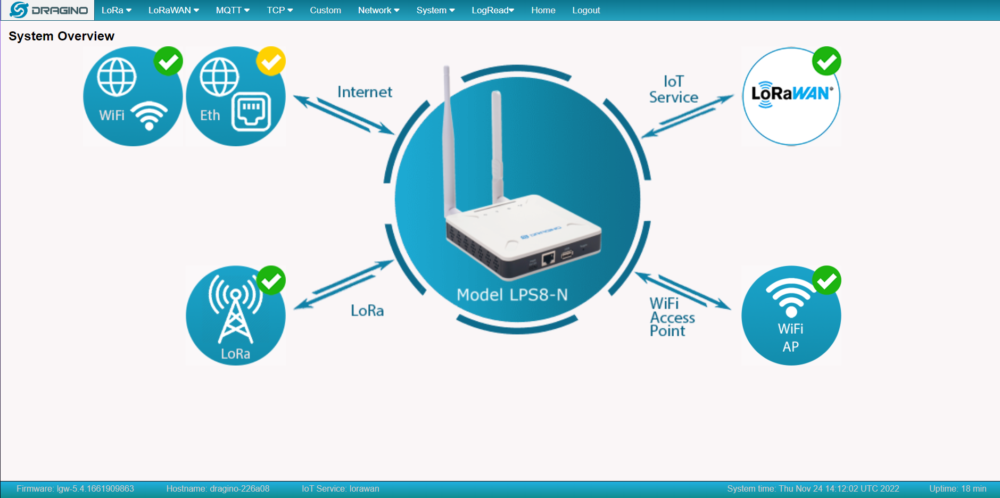
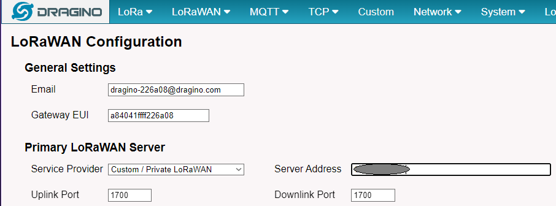

<link rel="stylesheet" href="../style.css">

### Aksel

### CAUBEL

#### RT2 IOM

<h1 class=headerTemplate style="text-align:center;">étendre</h1>

# Avant de commencer

Durant le S3 nous avons eux un aperçu de l'IOT. Cette aperçu ainsi que mon expérience en entreprise ne me permettent pas encore de répondre réellement à ces compétences. Je vous y répondrai avec plus de précision durant mon S4 grâce à l'expérience LoRa que je devrais équérir.

# Comprendre les architectures et spécificités des réseaux dédiés à l'IoT

//Explication de MQTT et la mise en place de refus des anonymes.

Avec LoRa comment les messages circules et comment il communique grave au différent information du capteur//

Dans un réseau IoT, on vise a consommer le moins d'énergie possible. Dans ce but il nous faut transmettre le moins de données possibles avec des protocoles qui nécessite peu de puissance à l'émission mais aussi qui possède des trames "utile" dans le sens ou tous les champs qui ne sont pas de la donnée soit réduit au maximum possible.

Pour répondre à c'est différentes problématique il existe plusieurs manières de conceptualiser des architectures IoT.

Prenons l'exemple d'une architecture LoRaWAN :

Tout d'abord nous avons le LoRa. Il est la technique de modulation pour envoyer les informations d'un capteur. Les signaux émit sont réceptionnablent par quiquonque possédent une GateWay LoRa. Une fois le signal LoRa capturé vient le LoRaWAN qui est le protocole qui va encapsuler le LoRa pour aller sur l'internet. Ce flux va ensuite être amené a un "Network Server" LoRa (port de fonctionnement 1700 tcp/udp) qui va permettre de décoder de la trame grâce aux informations des capteurs. Ce dernier communique avec un "Application Server" qui va par la suite nous permettre de récupérer les informations grâce a plusieurs intégrations de donnée différent. Pour ma part j'ai utilisé uniquement MQTT comme intégration data pour sa simplicité (port de fonctionnement 1883 -> 8883 MQTTS).A partir d'ici il faut un espace de stockage pour les données :

Et j'en viens à InfluxDB. Selon moi cette base de donnée est parfaite pour le stockage de donnée IoT. Nous possédons dans notre base de données des tables (bucket) avec comme clée primaire le temps, la possibilité de ne pas déclarer à l'avance notre structuration data pour avec une flexibilité très importante.

Tous va marcher grâce à des filtres qui selon moi se marie très bien avec MQTT. MQTT fonctionne avec des "topic" afin de faire circuler les données et donc un sujet peut être directement lu dans la structuration d'une base de donnée Influx. par exemple ici :

Dans cette arborecense InfluxDB servant au stockage de donnée de capteur de CO2 nous pouvons ressortir le topic MQTT qui contient l'id client, le type de donnée ainsi que le devEUI de notre capteur.

Pour finir notre architecture; L'interface Homme-Machine.

Il existe plusieurs façons de faire les représentations des données grâce à des graphiques simples avec l'outil Grafana ou bien des bibliothèques JavaScript comme chartJS.

Afin que vous aillez un visuel d'une architecture Global sous forme de schéma, je vous propose un schéma d'une application crée pour répondre à une problématique de bien-être annimal dans un poulailler :

TTN étant The Things Network, un réseau LoRa Privée.
le CEFE est l'emplacement ou nous étions et les "ttn-collector.py" et "sigfox-collector.py" sont deux programmes developper par moi même dans le but d'envoyer les données collectés par MQTT et par HTTP dans une base de donnée InfluxDB.

# Mettre en oeuvre des systèmes de transmissions pour l'accès à un réseau IoT

- mise en service de la passerelle LoRa de la SAE 3I04 et de la passerelle Dragino LPS8N mise en place

Comme mise en oeuvre d'un système de transmissions pour l'accès à un réseau IoT, je vous parlerez de la  mise en place de GateWay LoRa.

En terme d'action, ces mises en place ont été très rapide est simple avec très peu de configuration à faire.

L'une des choses les plus importante à faire est de savoir quels sont les ports à utilisés par notre application. Savoir les protocoles utilisés pour chacun en regardant si c'est du traffic sortant ou entrant. Une fois l'identification faite et les demandes d'ouvertures de port sur notre FireWall faite, nous pouvons commencer notre configuration et voir les résultats.

Lors de mon apprentissage au seins de la menuiserie Carayon, j'ai pu mettre en service deux GateWay LoRa (réf : Dragino LPS8-N).

La configuration de ce type de passerelle est très simple. Le paramétrage se fait directement sur une interface WEB.

Comme on le voit sur cette capture d'écran, la passerelle possède un point d'accès wifi qui nous permettra alors de faire la première configuration.

En se qui concerne la configuration LoRa, il nous suffit de choisir la bande de fréquence ( ici 868MHz [Règlementation oblige])

Comme stipulé dans la compétence précédente; En se qui concerne LoRaWAN il faudra le faire pointer un Network Server qui fonctionne nativement sur le port 1700. Voir ci dessous :

Bien évidement l'adresse de mon Network server est renseigné dans le champs (Server Address) mais pour des raisons de sécurité ce dernier n'apparaitra pas.

Durant la pose d'un réseau LoRaWAN dans un poulailler j'ai également pu utiliser une passerelle Multi-Tech aillant des champs supplémentaires à renseigner :

Le Duty Circle qui permet de définir chaque combien de temps souhaitons nous que l'on puisse envoyer des informations à nos capteurs (grâce aux normes défini pour l'utilisation LoRa)
