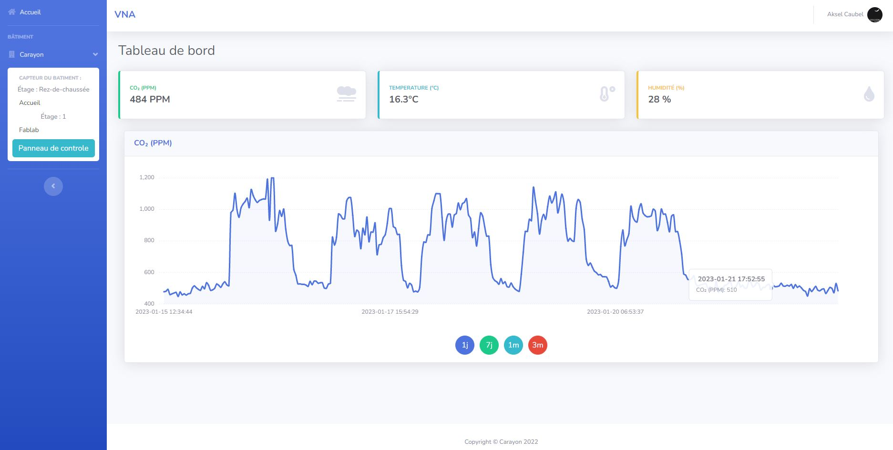
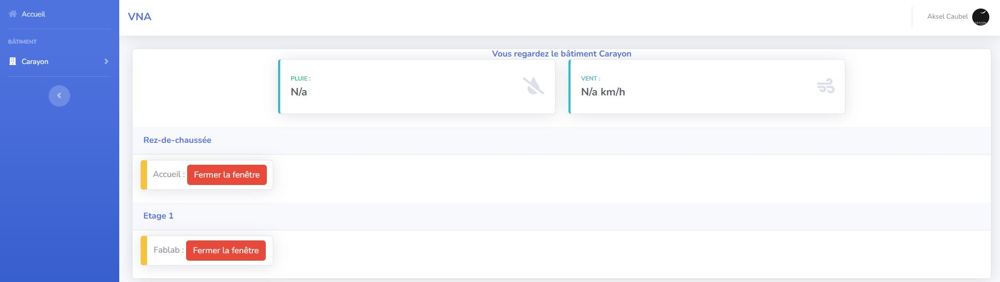

<link rel="stylesheet" href="../style.css">

### Aksel

### CAUBEL

#### RT2 IOM

<h1 class=headerTemplate style="text-align:center;">Exploiter</h1>

# Intégrer des systèmes électroniques et des systèmes d'exploitation embarqués

## Les systèmes d'électroniques embarqués

Ces systèmes sont relativements simple a concevoir;
Pour ma part j'ai pu utiliser des ESP-32 dans des buts relativement simple dans le but de faire des vérifications avec un capteur de position par exemple.

Mais actuellement je travaille sur la mise en place d'un système beaucoup plus complexe qui pemettra a partit d'un ESP-32 comme cerveau de géré l'ouverture d'une fenêtre à partir d'information centralisé sur un VPC dans le cloud.

C'est information provient eux même de d'autre ESP-32 qui mesureront le vent grâce à un anémomètre, la pluie grâce a un capteur de pluie par résistance ainsi que des informations de CO2/Températion/Humidité récolter par des capteurs indépendants.

Je travail également de manière personnel sur un dispositif toujours avec un ESP-32 qui avec une fixation et des bras imprimé en 3D pourrait appuyer sur un intéruption de volet électrique. Ce système sera relié par un système déjà mit en place : Un RaspBerry Pi avec comme système d'exploitation **Home Assistant**. Home Assistant permet par trâme ARP de repérer tous les objets connectés au réseau dans le but de faire des automatisations. Dans le cas de mon domicile, il permet de récupérer les données de mon imprimente, récupérer mes ampoules connectés ainsi que mes prises grâce à l'utilisation de l'outil IOT de l'application "*Tuya Smart*" ainsi que plein d'autres appareils.

# Mettre en oeuvre des protocoles pour les réseaux

Dans le contexte de l'Internet Des Objets, j'ai pu mettre en oeuvres des protocoles de communication à différent dégré mais j'estime que la mise en place des protocoles utilisés n'est pas suffisante pour l'appeler comme tel mais plutôt l'utilisation des protocoles avec une configuration standard.

Dans les protocoles utilisés on va retrouver en première place le protocole MQTT :

MQTT marche sous la forme de subcriber/providers en passant par un broker MQTT qui va géré la redistribution des flux de donnée.

Pour l'exemple je parlerai de Mosquitto qui est le seul broker que j'ai utilisé jusqu'à maintenant il est très simple a mettre en oeuvre pour sa version de base. Il suffit juste de l'installer et pour le sécuriser les connexion, interdire les utilisateurs **anonymes**. Je n'ai pas encore fait passer le protocole sous sa forme "sécurisé" mais cela se fera durant l'année.

Afin de faire une configuration standard pour MQTT qui est un protocole fonctionnant sur le port 1883 pour sa version non sécurisé il suffit de crée un fichier de stockage pour les mots de passe, et mettre dans le fichier de configuration c'est quelque ligne :

```c#
listener 1883 // Permet de définir le port d'écoute
allow_anonymous false // interdit les utilisateurs non connectés
password_file /etc/mosquitto/passwd // indique le fichier de stockage des mots de passe
```

Le protocole LoRa / LoRaWAN :

LoRa et LoRaWAN ne sont très souvent mélanger et pas utilisé au bon endroit.

LoRa est la technique de modulation du signal pour transmettre les informations relayés par un capteur avec un coût énergétique faible et une forte zone d'émission.

LoRaWAN quand a lui est le protocole réseau qui permet qu'une fois le signal LoRa est reçu par une GateWay LoRa, qu'il puisse arriver sur le Network Server de notre réseau.

La modulation est très technique et je manque de pratique et de documentation pour aller loin dans la technique mais pour la base nous devons faire attention à un certain nombre de paramètre :

- le Spread Factor (SF) :
     <pre>Allant de 7 à 12 il permet d'influer sur la largeur de la bande. Pour un SF 12 la largeur de la bande sera plus réduite ce qui va permettre d'économiser en énergie et également une meilleur résistance aux bruit. Mais on perdrait en porté d'émission.
     Pour un SF 7 on obtiendrait un résultat inverse.

     Pour les objets LoRa que j'ai pu installer lors de la mise en place de capteur dans un poulailler, les fabricants préconisent le SF 9.
      </pre>

- Le Duty Circle
  <pre>Afin de ne pas saturer les fréquences LoRa, le Duty Circle à était mit en place. Ce dernier nous dit que nous ne devons parler que un pourcent du temps ce qui veut dire que sur une période de 100secondes je ne peux en parler que 1seconde.</pre>

- La Fréquence

    <pre>La bande de fréquence pour le LoRa est très règlementé. Nous ne pouvons utiliser que certaine bande de Fréquence et pour ce qui nous concerne; En Europe la bande de fréquence est de 868MHz pour les applications à faible portée (1km) et 915MHz pour celle qui nécessite une porté plus importante</pre>

Par manque de connaissance / pratique je n'ai pas d'autre information capital ou que je ne saurais plus expliquer sur le sujet de LoRa. Je n'en deviendrais pas un expert mais au cours de mon S4, j'en connaitrais plus sur LoRa au vu de mon apprentissage qui me permettra de développer un réseau de communication LoRa avec mes propres devices.

Le protocole HTTP :

A l'heure actuelle, je ne vois pas de grande utilisation du protocole HTTP dans l'iot **(côté capteur)**. Les seuls utilisations que je lui trouverai et que j'ai déjà pu utiliser sont la mise en place de mise à jour OTA **(Over The Air)** grâce à une page HTTP ou l'on vient déposer le fichier binaire de notre code. Comme deuxième exemple j'ai pu mettre en place un scrapping d'une page web / questionner une API afin de faire une action ou bien un affichage.

Le protocole HTTP servira également pour faire le lien avec l'Homme pour la visualisation de Caméra ou de donnée par exemple.

Le protocole Sigfox :

Sigfox est mistérieux pour moi encore. Pour le moment mon utilisation de ce protocole c'est fait uniquement a travers la pose de capteur qui se connecte automatiquement aux réseaux Sigfox de ma zone pour ensuite grâce a leur API récolter les données par scrapping.

# Mettre en oeuvre des applications et traiter des données issues des objets connectés

Pour vous parlez d'une application IOT concrète:
Lors de mon apprentissage aux seins de la Menuiserie Carayon, j'ai pu et je continue de développer une application IOT nommé VNA-systeme pour Ventilation Naturelle Autonome. Elle consiste à améliorer la qualité de l'air intérieur grâce a des fenêtres intelligeante qui s'ouvre en cas de forte concentration de CO2. Le système comprend divers capteurs lui permettant de faire face à toute condition. Cette application est également crée avec un autre apprenti : PUIG Mathieu

Cette application à nécéssiter des choix importants, d'autant plus que nous travaillons en collaboration avec des menuisiers qui fabriquent les fenêtres ainsi que des dessinateurs pour la création de certaines pièces.

L'application pour sa première version est représentable de cette manière :

Des capteurs de Température / PPM (Co2) / Pression atmosphérique / Humidité sont disposés chez des clients.
La donnée est remonté via le protocole de communication LoRaWAN jusqu'à un VPC dans le cloud contenant un Application Network et un Server Network (ChirpStack port de fonctionnement 1700). Un Network Server est un service permettant de géré la partie de la communication LoRaWAN en gérant sa fréquence, en fesant attention aux collisions etc... Un Application Server quand a lui permet de faire le lien entre les devices et la retranmission de la donnée pour les différentes applications. Ici les données seront envoyé par l'application Server vers un broker MQTT de type Mosquitto (port de fonctionnement 1883/8883->MQTTS).

Un premier décodage est fait pour ensuite être renvoyé sur un nouveau sujet MQTT qui sera écouté par un un service "MQTT_Collector" fait en python par mes soins. Ce dernier permet que la donnée soit analysée pour en faire une gestion d'erreurs ainsi que l'envoyer sur notre base de donnée de type InfluxDB ( port de fonctionnement 8086). Ce système de MQTT_Collector aurait pu se faire avec Telegraph, une application courante de scrapping pour récolter les données sur InfluxDB mais pour des raisons de contrôle et de gestion avec tous les degrés de liberté possible, nous avons fait le choix de crée nous même se système.

Ce dernier point possède une faiblesse. Je me base sur des bibliothèques qui un jour peuvent être changé. Cela obligera donc une refonte du MQTT-Collector alors que Telegraph lui permettrai un utilisation avec moins de risque de ce côté puisqu'il sagit d'une application généraliste. Les deux possèdent des pour et des contres. Mais pour cette version le choix de la création personnel a été faite dans le but ne pas être bloqué par des lignes de code invisible et pouvoir crée notre propre chemin correspondant a nos besoins comme redistribuer des données a nos fenetres en fonction de ce que l'on reçoit comme information.

Une fois l'enregistrement des données faites il nous suffit d'une interface Homme-Machine pour que notre boucle soit bouclé.

Etat donné que nous somme sur un projet et nous avons une dead-line courant Février nous avons du presser le pas. Et pour crée cette interface Homme-Machine nous sommes partie de connaissance. N'aillant pas le temps de se former en un lapse de temps aussi court au langage de programmation Java ainsi qu'à React, qui aurait été notre premier choix technologique. Nous sommes parti sur la solution de Django. Aillant déjà eux une première expérience en Django nous avons pu démarrer rapidement le développement du site.

Pour le site nous avons opté pour l'utilisation d'une deuxième base de donnée avec une manière d'ordonnée les données différentes et plus adéquois : PostgreSQL.

La façon de stockage des données n'est pas comme InfluxDB. InfluxDB va être un choix IOT très intéressant puisque les Clées Primaires sont le **temps** mais pour une utilisation de stockage des utilisateurs ou autres données d'un site WEB, l'utilisation d'une base de donnée pouvant utiliser un Identifiant comme Clées Primaires est plus intéressante.

Comme dit précédement nous utilisons Django, cette application est donc crée en python sous forme de models, de vues et de templates.

Cette partie de application permet de visualisée les informations clées de l'air ambiant d'une pièce. Cela permet d'avoir un suivit de la température et de la qualité de l'air grâce au CO2.

Extrait du site :



Pour les différents graphiques nous utilisons un bibliothèque faite en Java-Script qui les génèrent automatiquement à partir des données influxDB qu'on lui retransmet.

Une autre partie de l'application concerne plus particulièrement la sécurité et le confort de le l'usagé.



Cette page qui est toujours en cours de développement en ce qui concerne le design, Permet de visualiser à distance l'information s'il pleut ou non ainsi que de la vitesse du vent à cette endroit. Mais on pourra y retrouver également l'état des fenêtres installées chez les clients avec l'unique possibilité de lancer une action de fermeture si la fenêtre n'est pas fermé et que nous souhaitons tout de même la fermer.
Les données de pluie est de vent sont très importantes car nous ne souhaitons pas innondé un batiment n'y même faire voler les papiers d'un bureau.

Pour notre première version nos fenêtres d'oté d'ESP-32 communiqueront par WiFi avec le protocole MQTT.

Par la suite une évolution sur du LoRaWAN devra être mit en place.
